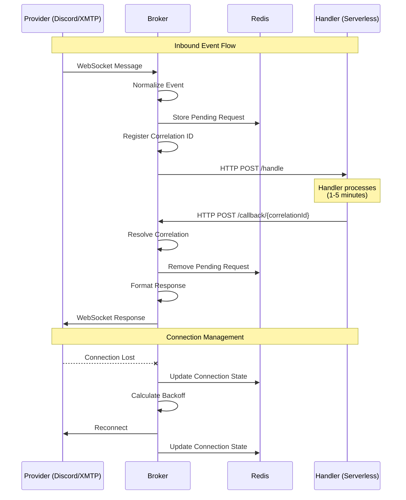

# @hybrd/broker

Stateful Connection Broker for managing persistent connections (WebSockets/TCP) to external providers and bridging events to stateless serverless handlers.

## Features

- **Connection Persistence**: Maintains long-lived connections without blocking the event loop
- **Event Normalization**: Converts provider-specific payloads to a standardized schema
- **Request-Response Bridge**: Proxies events to handlers and awaits responses (up to 5 minutes)
- **Concurrency**: Designed for thousands of simultaneous connections
- **Plug-and-Play Providers**: Easy interface for adding new services

## Installation

```bash
pnpm add @hybrd/broker
```

## Quick Start

```typescript
import { Broker, GenericWebSocketProvider } from '@hybrd/broker'

// Create the broker
const broker = new Broker({
  name: 'my-broker',
  port: 3000,
  callbackHost: 'https://broker.example.com',
  redis: { host: 'localhost', port: 6379 }
})

// Register a provider
broker.registerProvider('custom', (config) => 
  new GenericWebSocketProvider(config.name, config.type, 'wss://api.example.com/ws')
)

// Add handler routes
broker.addRoute({
  pattern: { provider: 'custom', eventType: 'message' },
  handler: {
    name: 'message-handler',
    trigger: 'http',
    url: 'https://api.example.com/handle',
    timeoutMs: 300000,
    retries: 3,
    retryDelayMs: 1000
  }
})

// Start the broker
await broker.start()

// Connect to a provider
const socketId = await broker.connect('custom', {
  sessionId: 'user-123',
  credentials: { apiKey: 'xxx' }
})
```

## Creating Custom Providers

Extend `BaseProvider` or `WebSocketProvider` to add support for new services:

```typescript
import { BaseProvider, type ProviderType } from '@hybrd/broker'

class DiscordProvider extends BaseProvider {
  readonly name = 'discord'
  readonly type: ProviderType = 'discord'

  protected async doConnect(options) {
    // Discord-specific connection logic
  }

  protected async doDisconnect(socketId) {
    // Discord-specific disconnect logic
  }

  protected async doSend(socketId, response) {
    // Discord-specific send logic
  }

  protected async doReconnect(socketId, sessionId) {
    // Discord-specific reconnect logic
  }

  normalize(raw, socketId, sessionId) {
    // Convert Discord events to InternalEvent
  }
}
```

## Architecture

See [ARCHITECTURE.md](./ARCHITECTURE.md) for detailed technical specification.

## Sequence Diagram



## API Reference

### Broker

```typescript
interface BrokerConfig {
  name?: string
  port?: number
  callbackHost?: string
  redis?: RedisStoreConfig
  defaultHandlerTimeoutMs?: number
}

class Broker {
  registerProvider(type: ProviderType, factory: ProviderFactory): void
  addRoute(route: HandlerRoute): void
  connect(type: ProviderType, options: ProviderConnectionOptions): Promise<string>
  disconnect(socketId: string): Promise<void>
  start(): Promise<void>
  stop(): Promise<void>
  getStats(): BrokerStats
}
```

### Internal Event Schema

```typescript
interface InternalEvent {
  correlationId: string
  sessionId: string
  socketId: string
  provider: ProviderType
  providerEventType: string
  eventType: NormalizedEventType
  payload: {
    content: string | Buffer
    contentType: string
    metadata?: Record<string, unknown>
  }
  sender: {
    id: string
    displayName?: string
  }
  conversation: {
    id: string
    type: 'dm' | 'group' | 'channel'
  }
  timestamp: number
  receivedAt: number
}
```

### Handler Configuration

```typescript
interface HttpHandlerConfig {
  name: string
  trigger: 'http'
  url: string
  timeoutMs: number
  retries: number
  retryDelayMs: number
  signatureSecret?: string
}
```

## License

MIT
